> **_NOTE:_** In an effort to streamline workflows and improve user experience,
CloudBees has phased out EC-Azure in favor of a new Azure CLI
plugin. We suggest you transition from using EC-Azure to
[Azure-CLI](https://docs.cloudbees.com/docs/cloudbees-cd-plugin-docs/latest/azurecli/), to maintain new feature support
and patch integration with CloudBees CD/RO.

# Integrated version

This plugin was developed and tested against Windows Azure 2012.

# Using this plugin

1. Install git, `sudo apt-get install git` or equivalent for your platform. 
1. Get this plugin `git clone https://github.com/electric-cloud/EC-Azure.git`. 

## Prerequisites

### Account requirements
An existing Azure account with the required credentials:
[Authenticating Azure Resource Manager requests](https://azure.microsoft.com/en-us/documentation/articles/resource-group-create-service-principal-portal/)

### Required files
- In the EC-Azure directory, create a file called `ecplugin.properties` with the following project-specific information:

        COMMANDER_SERVER=<COMMANDER_SERVER>(Commander server IP)
        COMMANDER_USER=<COMMANDER_USER>
        COMMANDER_PASSWORD=<COMMANDER_PASSWORD>

        CLIENT_ID=<AZURE_ACCOUNT_CLIENT_ID>
        TENANT_ID=<AZURE_ACCOUNT_TENANT_ID>
        CLIENT_SECRET=<AZURE_ACCOUNT_CLIENT_SECRET>
        SUBSCRIPTION_ID=<AZURE_ACCOUNT_SUBSCRIPTION_ID>

- Configure the `Configurations.json`. 
    1. This plugin includes a `Configurations.json` which is a configurable file. Refer to the sample `Configurations.json` located at `/src/test/java/ecplugins/azure/Configurations.json`.
    2.  Updated the `Configurations.json` with your project-specific *valid* inputs.

## Compile And Upload
1. Run gradlew to compile the plugin
   `./gradlew jar` (in EC-Azure directory)
1. Upload the plugin to EC server
1. Create a configuration for the EC-Azure plugin.

## Licensing
EC-Azure is licensed under the Apache License, Version 2.0. See [LICENSE](https://github.com/electric-cloud/EC-Azure/blob/master/LICENSE) for the full license text.

# Working with Windows certificates

Azure procedures may require a Windows certificate to authenticate
requests. To create and upload a certificate to Windows Azure:

1.  Generate an X.509 certificate using the Certificate Creation Tool
    (Makecert.exe) using the follow command:

    `makecert -sky exchange -r -n "CN=<CertificateName>" -pe -a sha1 -len 2048 -ss My "D:/<CertificateName>.cer"`

    Makecert.exe is included with Visual Studio and Windows SDK
    installations. For more information, refer to [Microsoft’s
    Makecert.exe
    page](http://msdn.microsoft.com/en-us/library/bfsktky3(VS.80).aspx).

2.  To upload the Windows certificate to Windows Azure, refer to
    [Configuring TLS for an application in
    Azure](https://azure.microsoft.com/en-us/documentation/articles/cloud-services-configure-ssl-certificate/).

# Plugin procedures

This plugin enables the following:

-   Database management

    -   [Create or update database](#Create-Or-Update-Database)

    -   [Delete database on server](#Delete_Database)

    -   [DeleteDatabase (Azure service)](#DeleteDatabase)

-   Group management

    -   [Create or update
        NetworkSecurityGroup](#Create_or_Update_NetworkSecurityGroup)

    -   [Delete NetworkSecurityGroup](#Delete_NetworkSecurityGroup)

    -   [Create or update
        NetworkSecurityRule](#Create_or_Update_NetworkSecurityRule)

    -   [Delete NetworkSecurityRule](#Delete_NetworkSecurityRule)

-   Network management

    -   [Create or update subnet](#Create_or_Update_Subnet)

    -   [Delete subnet](#Delete_Subnet)

    -   [CreateVnet](#CreateVnet)

    -   [DeleteVnet](#DeleteVnet)

-   VM management

    -   [CreateVM](#CreateVM)

    -   [Start VM](#Start_VM)

    -   [Restart VM](#Restart_VM)

    -   [Stop VM](#Stop_VM)

    -   [Delete VM](#Delete_VM)

-   SQL and NoSQL operations

    -   [SQL operations](#SQL_Operations)

    -   [NoSQL operations](#NoSQL_Operations)

-   Resource management

    -   [Teardown](#Teardown)

# Plugin configuration

Plugin configurations are sets of parameters that apply across some or
all of the plugin’s procedures. They are intended to reduce repetition
of common values, create predefined sets of parameters for end users,
and to securely store credentials where needed. Each configuration is
given a unique name that is entered in designated parameters on
procedures that use them.

Subscription ID must be created and an X.509 management certificate
needs to be uploaded to the certificate store. You can do this using the
[Management Portal](https://www.windowsazure.com)

<table>
<colgroup>
<col style="width: 50%" />
<col style="width: 50%" />
</colgroup>
<thead>
<tr class="header">
<th style="text-align: left;">Parameter</th>
<th style="text-align: left;">Description</th>
</tr>
</thead>
<tbody>
<tr class="odd">
<td style="text-align: left;">
Configuration Name
</td>
<td style="text-align: left;">
Provide a unique name for the
configuration, keeping in mind that you may need to create additional
configurations over time. (Required)
</td>
</tr>
<tr class="even">
<td style="text-align: left;">
Description
</td>
<td style="text-align: left;">
A description for this
configuration.
</td>
</tr>
<tr class="odd">
<td style="text-align: left;">
Tenant ID
</td>
<td style="text-align: left;">
Enter the Azure Active Directory Tenant
ID. (Required)
</td>
</tr>
<tr class="even">
<td style="text-align: left;">
Subscription ID
</td>
<td style="text-align: left;">
Enter the Azure Active Directory
Subscription ID. (Required)
</td>
</tr>
<tr class="odd">
<td style="text-align: left;">
Client ID/Secret Key
</td>
<td style="text-align: left;">
Azure Application Client ID and
Secret(Password). (Required)
</td>
</tr>
<tr class="even">
<td style="text-align: left;">
VM User/Password
</td>
<td style="text-align: left;">
Credentials for any virtual machines
provisioned using this configuration. (Required)
</td>
</tr>
<tr class="odd">
<td style="text-align: left;">
Resource Pool
</td>
<td style="text-align: left;">
The name of the pool of resources on
which the integration steps can run. (Required)
</td>
</tr>
<tr class="even">
<td style="text-align: left;">
Debug Level:
</td>
<td style="text-align: left;">
Level for output: 0=errors only,
1=normal headers and responses, 2+=debugging information included.
(Required)
</td>
</tr>
</tbody>
</table>

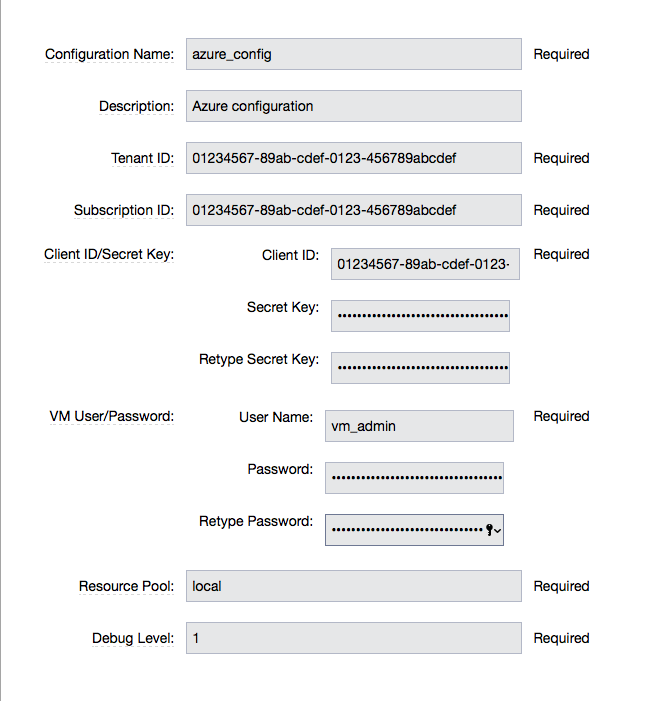

## Create or update database

This procedure allows users to create or update the Database on a
Database server.

<table>
<colgroup>
<col style="width: 50%" />
<col style="width: 50%" />
</colgroup>
<thead>
<tr class="header">
<th style="text-align: left;">Parameter</th>
<th style="text-align: left;">Description</th>
</tr>
</thead>
<tbody>
<tr class="odd">
<td style="text-align: left;">
Configuration
</td>
<td style="text-align: left;">
The name of the configuration which
holds all the connection information for Windows Azure.
(Required)
</td>
</tr>
<tr class="even">
<td style="text-align: left;">
Resource Group Name
</td>
<td style="text-align: left;">
The name of the Resource Group to which
the Azure SQL Database Server belongs. (Required)
</td>
</tr>
<tr class="odd">
<td style="text-align: left;">
Server name
</td>
<td style="text-align: left;">
The short name of the Azure SQL
Database Server on which the database is hosted. For example,
<code>testsqlserver001</code> should be used instead of
<code>testsqlserver001.database.windows.net</code>. (Required)
</td>
</tr>
<tr class="even">
<td style="text-align: left;">
Database name
</td>
<td style="text-align: left;">
The name of the Azure SQL Database to
be operated on (updated or created). (Required)
</td>
</tr>
<tr class="odd">
<td style="text-align: left;">
Location
</td>
<td style="text-align: left;">
Location of the resource.
(Required)
</td>
</tr>
<tr class="even">
<td style="text-align: left;">
Edition
</td>
<td style="text-align: left;">
Edition for the Azure SQL
Database.
</td>
</tr>
<tr class="odd">
<td style="text-align: left;">
Collation
</td>
<td style="text-align: left;">
Collation of the Azure SQL Database
being created.
</td>
</tr>
<tr class="even">
<td style="text-align: left;">
Create Mode
</td>
<td style="text-align: left;">
Create Mode for the Azure SQL Database
being created.
</td>
</tr>
<tr class="odd">
<td style="text-align: left;">
Elastic Pool
</td>
<td style="text-align: left;">
The name of the Elastic Pool to put the
Azure SQL Database in.
</td>
</tr>
<tr class="even">
<td style="text-align: left;">
Maximum Size in MB
</td>
<td style="text-align: left;">
The maximum size of the Azure SQL
Database being created or updated in megabytes.
</td>
</tr>
<tr class="odd">
<td style="text-align: left;">
Service Objective Id
</td>
<td style="text-align: left;">
The service objective to be applied to
the Azure SQL Database being created or updated.
</td>
</tr>
<tr class="even">
<td style="text-align: left;">
Source Database Id
</td>
<td style="text-align: left;">
The resource id of the database to use
as the source for the copy being created.
</td>
</tr>
<tr class="odd">
<td style="text-align: left;">
JobStep Timeout
</td>
<td style="text-align: left;">
Timeout for the step execution in
minutes. Blank means no timeout.
</td>
</tr>
</tbody>
</table>

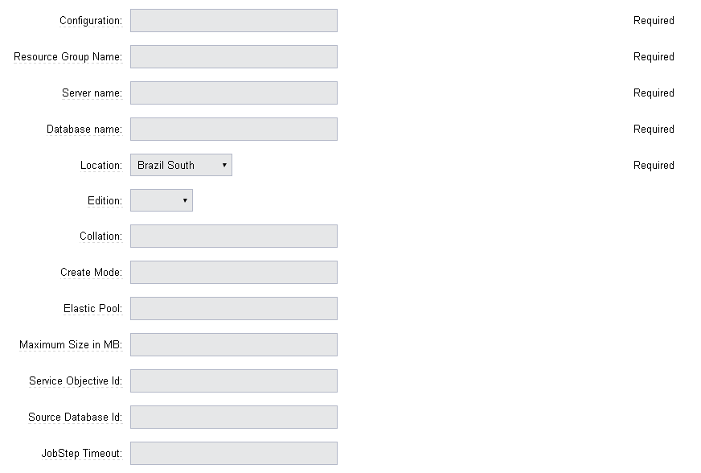

## Delete database on server

This procedure allows users to delete the Database on a Database server.

<table>
<colgroup>
<col style="width: 50%" />
<col style="width: 50%" />
</colgroup>
<thead>
<tr class="header">
<th style="text-align: left;">Parameter</th>
<th style="text-align: left;">Description</th>
</tr>
</thead>
<tbody>
<tr class="odd">
<td style="text-align: left;">
Configuration
</td>
<td style="text-align: left;">
The name of the configuration which
holds all the connection information for Windows Azure.
(Required)
</td>
</tr>
<tr class="even">
<td style="text-align: left;">
Resource Group Name
</td>
<td style="text-align: left;">
The name of the Resource Group to which
the Azure SQL Database Server belongs. (Required)
</td>
</tr>
<tr class="odd">
<td style="text-align: left;">
Server name
</td>
<td style="text-align: left;">
The short name of the Azure SQL
Database Server on which the database is hosted. For example,
<code>testsqlserver001</code> should be used instead of
<code>testsqlserver001.database.windows.net</code>. (Required)
</td>
</tr>
<tr class="even">
<td style="text-align: left;">
Database name
</td>
<td style="text-align: left;">
The name of the Azure SQL Database to
be deletes. (Required)
</td>
</tr>
<tr class="odd">
<td style="text-align: left;">
JobStep Timeout
</td>
<td style="text-align: left;">
Timeout for the step execution in
minutes. Blank means no timeout.
</td>
</tr>
</tbody>
</table>

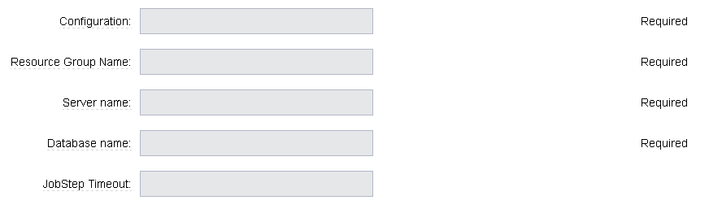

## DeleteDatabase (Azure service)

This procedure allows users to delete a database on a database server
using Azure Services.

<table>
<colgroup>
<col style="width: 50%" />
<col style="width: 50%" />
</colgroup>
<thead>
<tr class="header">
<th style="text-align: left;">Parameter</th>
<th style="text-align: left;">Description</th>
</tr>
</thead>
<tbody>
<tr class="odd">
<td style="text-align: left;">
Configuration
</td>
<td style="text-align: left;">
The name of the configuration which
holds all the connection information for Windows Azure.
(Required)
</td>
</tr>
<tr class="even">
<td style="text-align: left;">
Resource Group Name
</td>
<td style="text-align: left;">
The name of the Resource Group to which
the Azure SQL Database Server belongs. (Required)
</td>
</tr>
<tr class="odd">
<td style="text-align: left;">
Server name
</td>
<td style="text-align: left;">
The name of the Azure SQL Database
Server on which the database is hosted. (Required)
</td>
</tr>
<tr class="even">
<td style="text-align: left;">
Database name
</td>
<td style="text-align: left;">
The name of the Azure SQL Database to
be operated on (Updated or created). (Required)
</td>
</tr>
<tr class="odd">
<td style="text-align: left;">
JobStep Timeout
</td>
<td style="text-align: left;">
Timeout for the step execution in
minutes. Blank means no timeout.
</td>
</tr>
</tbody>
</table>

## Create or update NetworkSecurityGroup

This procedure allows users to create or update a Network Security
Group.

<table>
<colgroup>
<col style="width: 50%" />
<col style="width: 50%" />
</colgroup>
<thead>
<tr class="header">
<th style="text-align: left;">Parameter</th>
<th style="text-align: left;">Description</th>
</tr>
</thead>
<tbody>
<tr class="odd">
<td style="text-align: left;">
Configuration
</td>
<td style="text-align: left;">
The name of the configuration which
holds all the connection information for Windows Azure.
(Required)
</td>
</tr>
<tr class="even">
<td style="text-align: left;">
Resource Group Name
</td>
<td style="text-align: left;">
The name of the Resource Group to which
the Azure SQL Database Server belongs. (Required)
</td>
</tr>
<tr class="odd">
<td style="text-align: left;">
Location
</td>
<td style="text-align: left;">
Location of the resource.
(Required)
</td>
</tr>
<tr class="even">
<td style="text-align: left;">
Security Rule
</td>
<td style="text-align: left;">
Security Rule with the same name can be
created in multiple Network Security Group and Network Security Group
with same name can be created in multiple Resource Group. Provide nested
JSON to uniquely identify security rule. Example:

<code>\{"RG-1":\{"NSG-1":["Rule-A", "Rule-B"], "NSG-2":["Rule-C", "Rule-D"]},
"RG-2":\{"NSG-3":"RULE-G"}}</code>
</td>
</tr>
<tr class="odd">
<td style="text-align: left;">
JobStep Timeout
</td>
<td style="text-align: left;">
Timeout for the step execution in
minutes. Blank means no timeout.
</td>
</tr>
</tbody>
</table>

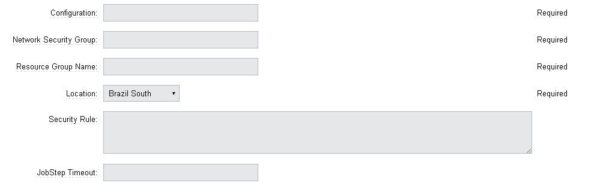

## Delete NetworkSecurityGroup

This procedure allows users to delete a Network Security Group.

<table>
<colgroup>
<col style="width: 50%" />
<col style="width: 50%" />
</colgroup>
<thead>
<tr class="header">
<th style="text-align: left;">Parameter</th>
<th style="text-align: left;">Description</th>
</tr>
</thead>
<tbody>
<tr class="odd">
<td style="text-align: left;">
Configuration
</td>
<td style="text-align: left;">
The name of the configuration which
holds all the connection information for Windows Azure.
(Required)
</td>
</tr>
<tr class="even">
<td style="text-align: left;">
Network Security Group
</td>
<td style="text-align: left;">
Name of the Network security Group
which is to be deleted. (Required)
</td>
</tr>
<tr class="odd">
<td style="text-align: left;">
Resource Group Name
</td>
<td style="text-align: left;">
The name of the resource group in which
network security group is present. (Required)
</td>
</tr>
<tr class="even">
<td style="text-align: left;">
JobStep Timeout
</td>
<td style="text-align: left;">
Timeout for the step execution in
minutes. Blank means no timeout.
</td>
</tr>
</tbody>
</table>

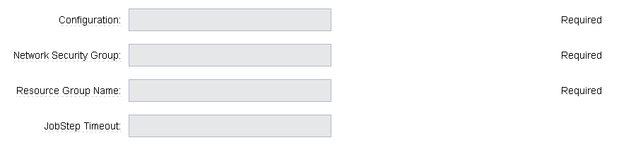

## Create or update NetworkSecurityRule

This procedure allows users to create or update a Rule of a Network
Security Group.

<table>
<colgroup>
<col style="width: 50%" />
<col style="width: 50%" />
</colgroup>
<thead>
<tr class="header">
<th style="text-align: left;">Parameter</th>
<th style="text-align: left;">Description</th>
</tr>
</thead>
<tbody>
<tr class="odd">
<td style="text-align: left;">
Configuration
</td>
<td style="text-align: left;">
The name of the configuration which
holds all the connection information for Windows Azure.
(Required)
</td>
</tr>
<tr class="even">
<td style="text-align: left;">
Network Security Rule
</td>
<td style="text-align: left;">
Name of the network security rule to be
created. (Required)
</td>
</tr>
<tr class="odd">
<td style="text-align: left;">
Network Security Group
</td>
<td style="text-align: left;">
Network security Group in which network
security rule is to be created. (Required)
</td>
</tr>
<tr class="even">
<td style="text-align: left;">
Resource Group Name
</td>
<td style="text-align: left;">
The name of the resource group in which
network security rule will be present. (Required)
</td>
</tr>
<tr class="odd">
<td style="text-align: left;">
Access
</td>
<td style="text-align: left;">
Network traffic is allowed or denied.
(Required)
</td>
</tr>
<tr class="even">
<td style="text-align: left;">
Description
</td>
<td style="text-align: left;">
Description for this rule.
</td>
</tr>
<tr class="odd">
<td style="text-align: left;">
Source Address Prefix
</td>
<td style="text-align: left;">
Source address prefix. CIDR or source
IP range.An asterisk can also be used to match all source IPs
(Required)
</td>
</tr>
<tr class="even">
<td style="text-align: left;">
Source Port Range
</td>
<td style="text-align: left;">
Source Port Range. Integer or range
between 0 and 65535. An asterisk can also be used to match all ports
(Required)
</td>
</tr>
<tr class="odd">
<td style="text-align: left;">
Destination Address Prefix
</td>
<td style="text-align: left;">
Destination address prefix. CIDR or
source IP range. An asterisk can also be used to match all source IPs.
(Required)
</td>
</tr>
<tr class="even">
<td style="text-align: left;">
Destination Port Range
</td>
<td style="text-align: left;">
Destination Port Range. Integer or
range between 0 and 65535. An asterisk can also be used to match all
ports. (Required)
</td>
</tr>
<tr class="odd">
<td style="text-align: left;">
Direction
</td>
<td style="text-align: left;">
The direction of the rule.InBound or
Outbound. The direction specifies if rule will be evaluated on incoming
or outcoming traffic. (Required)
</td>
</tr>
<tr class="even">
<td style="text-align: left;">
Priority
</td>
<td style="text-align: left;">
The priority of the rule. The value can
be between 100 and 4096. The priority number must be unique for each
rule in the collection. The lower the priority number, the higher the
priority of the rule. (Required)
</td>
</tr>
<tr class="odd">
<td style="text-align: left;">
Protocol
</td>
<td style="text-align: left;">
Network protocol this rule applies to.
Can be Tcp, Udp or All(*). (Required)
</td>
</tr>
<tr class="even">
<td style="text-align: left;">
JobStep Timeout
</td>
<td style="text-align: left;">
Timeout for the step execution in
minutes. Blank means no timeout.
</td>
</tr>
</tbody>
</table>

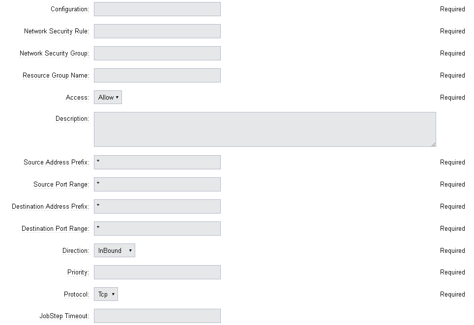

## Delete NetworkSecurityRule

This procedure allows users to delete a Rule from an existing Network
Security Group.

<table>
<colgroup>
<col style="width: 50%" />
<col style="width: 50%" />
</colgroup>
<thead>
<tr class="header">
<th style="text-align: left;">Parameter</th>
<th style="text-align: left;">Description</th>
</tr>
</thead>
<tbody>
<tr class="odd">
<td style="text-align: left;">
Configuration
</td>
<td style="text-align: left;">
The name of the configuration which
holds all the connection information for Windows Azure.
(Required)
</td>
</tr>
<tr class="even">
<td style="text-align: left;">
Network Security Rule
</td>
<td style="text-align: left;">
Name of the Network security Rule which
is to be deleted. (Required)
</td>
</tr>
<tr class="odd">
<td style="text-align: left;">
Network Security Group
</td>
<td style="text-align: left;">
Name of the Network security Group in
which network security rule is present. (Required)
</td>
</tr>
<tr class="even">
<td style="text-align: left;">
Resource Group Name
</td>
<td style="text-align: left;">
The name of the resource group in which
network security group is present. (Required)
</td>
</tr>
<tr class="odd">
<td style="text-align: left;">
JobStep Timeout
</td>
<td style="text-align: left;">
Timeout for the step execution in
minutes. Blank means no timeout.
</td>
</tr>
</tbody>
</table>

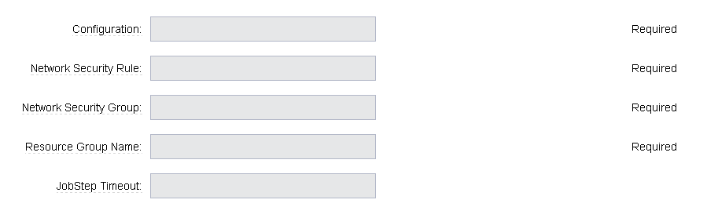

## Create or update subnet

This procedure allows users to create or update a subnet.

<table>
<colgroup>
<col style="width: 50%" />
<col style="width: 50%" />
</colgroup>
<thead>
<tr class="header">
<th style="text-align: left;">Parameter</th>
<th style="text-align: left;">Description</th>
</tr>
</thead>
<tbody>
<tr class="odd">
<td style="text-align: left;">
Configuration
</td>
<td style="text-align: left;">
The name of the configuration which
holds all the connection information for Windows Azure.
(Required)
</td>
</tr>
<tr class="even">
<td style="text-align: left;">
Subnet
</td>
<td style="text-align: left;">
Name of the subnet to be created.
(Required)
</td>
</tr>
<tr class="odd">
<td style="text-align: left;">
Virtual Network Name
</td>
<td style="text-align: left;">
The name of the virtual network in
which subnet will be present. (Required)
</td>
</tr>
<tr class="even">
<td style="text-align: left;">
Resource Group Name
</td>
<td style="text-align: left;">
The name of the resource group in which
subnet is to be created. (Required)
</td>
</tr>
<tr class="odd">
<td style="text-align: left;">
Address Prefix
</td>
<td style="text-align: left;">
It should follow CIDR notation, for
example, <code>10.0.0.0/24</code> (Required)
</td>
</tr>
<tr class="even">
<td style="text-align: left;">
Network Security Group
</td>
<td style="text-align: left;">
Network security Group to be attached.
Network Security Group of same name can be present in multiple resource
group. Provide Json to uniquely identify Network Security Group.
Example: <code>\{"RG1":"NSG1"}</code>
</td>
</tr>
<tr class="odd">
<td style="text-align: left;">
Route Table
</td>
<td style="text-align: left;">
RouteTable of same name can be present
in multiple resource group. Provide Json to uniquely identify
RouteTable. Example: <code>\{"RG1":"routeTable"}</code>
</td>
</tr>
<tr class="even">
<td style="text-align: left;">
JobStep Timeout
</td>
<td style="text-align: left;">
Timeout for the step execution in
minutes. Blank means no timeout.
</td>
</tr>
</tbody>
</table>

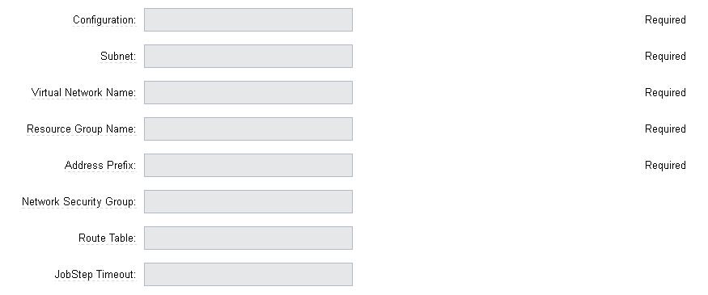

## Delete subnet

This procedure allows users to delete a subnet.

<table>
<colgroup>
<col style="width: 50%" />
<col style="width: 50%" />
</colgroup>
<thead>
<tr class="header">
<th style="text-align: left;">Parameter</th>
<th style="text-align: left;">Description</th>
</tr>
</thead>
<tbody>
<tr class="odd">
<td style="text-align: left;">
Configuration
</td>
<td style="text-align: left;">
The name of the configuration which
holds all the connection information for Windows Azure.
(Required)
</td>
</tr>
<tr class="even">
<td style="text-align: left;">
Subnet
</td>
<td style="text-align: left;">
Name of the subnet which is to be
deleted. (Required)
</td>
</tr>
<tr class="odd">
<td style="text-align: left;">
Virtual Network
</td>
<td style="text-align: left;">
Name of the virtual network in which
subnet is present. (Required)
</td>
</tr>
<tr class="even">
<td style="text-align: left;">
Resource Group Name
</td>
<td style="text-align: left;">
The name of the resource group in which
subnet is present. (Required)
</td>
</tr>
<tr class="odd">
<td style="text-align: left;">
JobStep Timeout
</td>
<td style="text-align: left;">
Timeout for the step execution in
minutes. Blank means no timeout.
</td>
</tr>
</tbody>
</table>

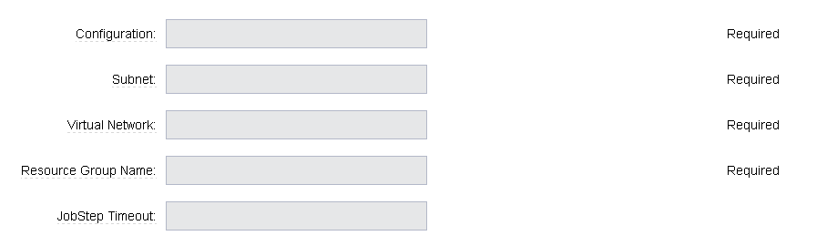

## CreateVnet

This procedure allows users to create a Virtual Network using Azure
Services.

<table>
<colgroup>
<col style="width: 50%" />
<col style="width: 50%" />
</colgroup>
<thead>
<tr class="header">
<th style="text-align: left;">Parameter</th>
<th style="text-align: left;">Description</th>
</tr>
</thead>
<tbody>
<tr class="odd">
<td style="text-align: left;">
Configuration
</td>
<td style="text-align: left;">
The name of the configuration which
holds all the connection information for Windows Azure.
(Required)
</td>
</tr>
<tr class="even">
<td style="text-align: left;">
Virtual Network name
</td>
<td style="text-align: left;">
Name of the new Virtual Network.
(Required)
</td>
</tr>
<tr class="odd">
<td style="text-align: left;">
Virtual Network address space
</td>
<td style="text-align: left;">
The Virtual Network’s address space in
CIDR notion. It must be contained in one of the standard private address spaces:

- <code>10.0.0.0/8</code>
- <code>172.16.0.0/12</code>
- <code>192.168.0.0/16</code>

Example: <code>10.12.0.0/16 → 10.12.0.0 - 10.12.255.255</code> (65536 addresses). (Required)
</td>
</tr>
<tr class="even">
<td style="text-align: left;">
Subnet name
</td>
<td style="text-align: left;">
Name of the new Subnet.
(Required)
</td>
</tr>
<tr class="odd">
<td style="text-align: left;">
Subnet address space
</td>
<td style="text-align: left;">
The Subnet’s address space in CIDR
notion. It must be contained in one of the standard private address spaces:

- <code>10.0.0.0/8</code>
- <code>172.16.0.0/12</code>
- <code>192.168.0.0/16</code>

Example: <code>10.12.0.0/24 → 10.12.0.0 - 10.12.0.255 </code>(256 addresses). (Required)
</td>
</tr>
<tr class="even">
<td style="text-align: left;">
Custom DNS Server
</td>
<td style="text-align: left;">
Address of DNS Server.
</td>
</tr>
<tr class="odd">
<td style="text-align: left;">
Resource Group Name
</td>
<td style="text-align: left;">
The name of the resource group in which
the Virtual network is to be created. (Required)
</td>
</tr>
<tr class="even">
<td style="text-align: left;">
Location
</td>
<td style="text-align: left;">
Location of the resource.
(Required)
</td>
</tr>
<tr class="odd">
<td style="text-align: left;">
JobStep Timeout
</td>
<td style="text-align: left;">
Timeout for the step execution in
minutes. Blank means no timeout.
</td>
</tr>
</tbody>
</table>

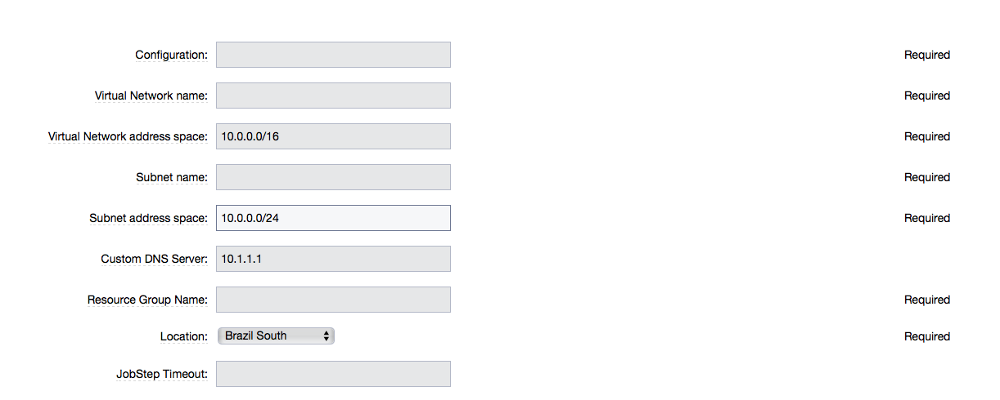

## DeleteVnet

This procedure allows users to delete a Virtual Network using Azure
Services.

<table>
<colgroup>
<col style="width: 50%" />
<col style="width: 50%" />
</colgroup>
<thead>
<tr class="header">
<th style="text-align: left;">Parameter</th>
<th style="text-align: left;">Description</th>
</tr>
</thead>
<tbody>
<tr class="odd">
<td style="text-align: left;">
Configuration
</td>
<td style="text-align: left;">
The name of the configuration which
holds all the connection information for Windows Azure.
(Required)
</td>
</tr>
<tr class="even">
<td style="text-align: left;">
Virtual Network name
</td>
<td style="text-align: left;">
Name of the new Virtual Network.
(Required)
</td>
</tr>
<tr class="odd">
<td style="text-align: left;">
Resource Group Name
</td>
<td style="text-align: left;">
The name of the resource group in which
the Virtual network is to be deleted. (Required)
</td>
</tr>
<tr class="even">
<td style="text-align: left;">
JobStep Timeout
</td>
<td style="text-align: left;">
Timeout for the step execution in
minutes. Blank means no timeout.
</td>
</tr>
</tbody>
</table>

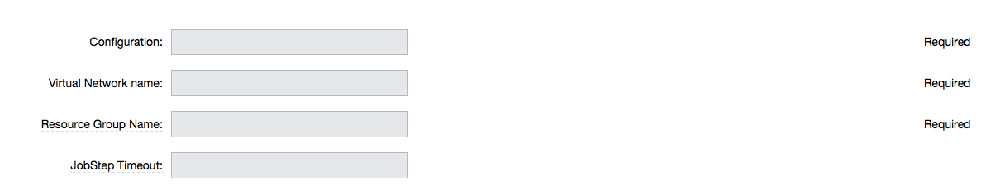

## CreateVM

This procedure allows users to create a VM using Azure Services.

<table>
<colgroup>
<col style="width: 50%" />
<col style="width: 50%" />
</colgroup>
<thead>
<tr class="header">
<th style="text-align: left;">Parameter</th>
<th style="text-align: left;">Description</th>
</tr>
</thead>
<tbody>
<tr class="odd">
<td style="text-align: left;">
Configuration
</td>
<td style="text-align: left;">
The name of the configuration which
holds all the connection information for Windows Azure.
(Required)
</td>
</tr>
<tr class="even">
<td style="text-align: left;">
Server Name
</td>
<td style="text-align: left;">
Name of the new Server.
(Required)
</td>
</tr>
<tr class="odd">
<td style="text-align: left;">
Number of Instances
</td>
<td style="text-align: left;">
Number of instances to be created.
(Required)
</td>
</tr>
<tr class="even">
<td style="text-align: left;">
Image URN
</td>
<td style="text-align: left;">
The image URN in the form
<code>publisherName:offer:skus:version/</code>. The source VHD link of a user image.
For example,
<code>https://foo.blob.core.windows.net/system/Microsoft.Compute/Images/vhds/snap-bar.vhd</code>.(Required)

For your user image to be accepted, it must belong to a storage
account in same resource group as VM itself (this is Azure’s
requirement).

</td>
</tr>
<tr class="odd">
<td style="text-align: left;">
Is User Image?
</td>
<td style="text-align: left;">
Provided URN is of user image or
not?
</td>
</tr>
<tr class="even">
<td style="text-align: left;">
Disable Password Prompt?
</td>
<td style="text-align: left;">
Disable password authentication in case
of superuser privileges?
</td>
</tr>
<tr class="odd">
<td style="text-align: left;">
Public Key
</td>
<td style="text-align: left;">
Public key for authentication of
created Virtual machine for the client:

<ul>
<li>
<code>ssh-keygen -t rsa -b 2048</code>
</li>
<li>
<code>openssl req -x509 -key ~/.ssh/id_rsa -nodes -days 365 -newkey rsa:2048 -out public.pem</code>
</li>
</ul></td>
</tr>
<tr class="even">
<td style="text-align: left;">
Operating System Type
</td>
<td style="text-align: left;">
Required only for user images.
</td>
</tr>
<tr class="odd">
<td style="text-align: left;">
Resource Group Name
</td>
<td style="text-align: left;">
The name of the resource group in which
VM is to be created. (Required)
</td>
</tr>
<tr class="even">
<td style="text-align: left;">
Location
</td>
<td style="text-align: left;">
Location of the resource.
(Required)
</td>
</tr>
<tr class="odd">
<td style="text-align: left;">
Storage Account
</td>
<td style="text-align: left;">
Name of storage account. (Required)

If this storage account resides in a resource group different from VM
itself, it must be specified via -rgn prefix argument.

For example,
<code>-rgn ResourceGroupName StorageAccountName</code>
</td>
</tr>
<tr class="even">
<td style="text-align: left;">
Storage Container
</td>
<td style="text-align: left;">
Name of the storage container.
(Required)
</td>
</tr>
<tr class="odd">
<td style="text-align: left;">
Virtual Network
</td>
<td style="text-align: left;">
Name of an existing Virtual Network for
VM to be connected to.

If this virtual network resides in a resource group different from VM
itself, it must be specified via -rgn prefix argument.

For example,
<code>-rgn ResourceGroupName VirtualNetworkName</code>
</td>
</tr>
<tr class="even">
<td style="text-align: left;">
Subnet
</td>
<td style="text-align: left;">
Name of an existing subnet within a
Virtual Network. Requires Virtual Network to be set.
</td>
</tr>
<tr class="odd">
<td style="text-align: left;">
Create Public IP Address?
</td>
<td style="text-align: left;">
Create Public IP address for the
deployed servers?
</td>
</tr>
<tr class="even">
<td style="text-align: left;">
Resource Pool
</td>
<td style="text-align: left;"></td>
</tr>
<tr class="odd">
<td style="text-align: left;">
Resource Port
</td>
<td style="text-align: left;">
If you specify a resource pool name in
 <code>Resource Pool</code> field, this is the port that will be used when
creating the resource. If no value is specified, port 7800 will be used
by default when creating the resource.
</td>
</tr>
<tr class="even">
<td style="text-align: left;">
Resource workspace
</td>
<td style="text-align: left;">
If you specify a resource pool name,
this is the workspace that will be assigned to the created
resources.
</td>
</tr>
<tr class="odd">
<td style="text-align: left;">
Resource Zone Name
</td>
<td style="text-align: left;">
Created resource will belong to the
specified zone. Zone  <code>default</code> is used by default.
</td>
</tr>
<tr class="even">
<td style="text-align: left;">
Machine size
</td>
<td style="text-align: left;">
Size of the machine. For example,
Standard_D2_v2. Refer to <a 
href="https://docs.microsoft.com/en-us/azure/cloud-services/cloud-services-sizes-specs">
Virtual machines sizes</a> for reference.
</td>
</tr>
<tr class="odd">
<td style="text-align: left;">
Results Location
</td>
<td style="text-align: left;">
Location where the output properties is
saved. If not specified, this defaults to
<code>/myJob/Azure/deployed</code>.
</td>
</tr>
<tr class="even">
<td style="text-align: left;">
JobStep Timeout
</td>
<td style="text-align: left;">
Timeout for the step execution in
minutes. Blank means no timeout.
</td>
</tr>
</tbody>
</table>

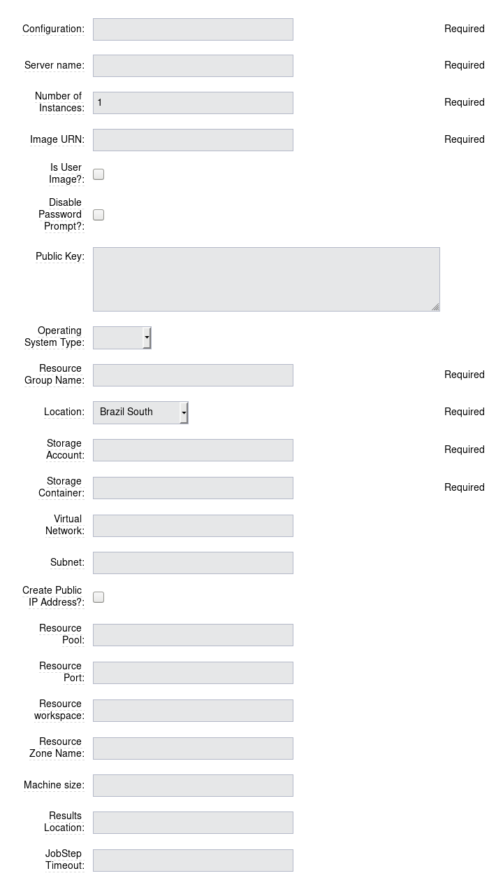

## Start VM

This procedure allows users to start a stopped VM.

<table>
<colgroup>
<col style="width: 50%" />
<col style="width: 50%" />
</colgroup>
<thead>
<tr class="header">
<th style="text-align: left;">Parameter</th>
<th style="text-align: left;">Description</th>
</tr>
</thead>
<tbody>
<tr class="odd">
<td style="text-align: left;">
Configuration
</td>
<td style="text-align: left;">
The name of the configuration which
holds all the connection information for Windows Azure.
(Required)
</td>
</tr>
<tr class="even">
<td style="text-align: left;">
Resource Group Name
</td>
<td style="text-align: left;">
The name of the resource group in which
VM is to be started. (Required)
</td>
</tr>
<tr class="odd">
<td style="text-align: left;">
VM Name
</td>
<td style="text-align: left;">
The Name of the Virtual Machine to be
started. (Required)
</td>
</tr>
<tr class="even">
<td style="text-align: left;">
JobStep Timeout
</td>
<td style="text-align: left;">
Timeout for the step execution in
minutes. Blank means no timeout.
</td>
</tr>
</tbody>
</table>

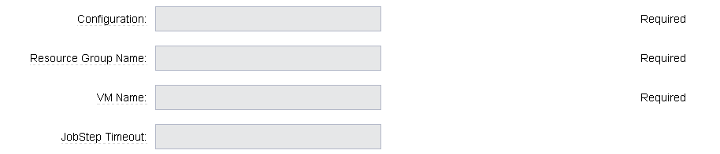

## Restart VM

This procedure allows users to restart a VM.

<table>
<colgroup>
<col style="width: 50%" />
<col style="width: 50%" />
</colgroup>
<thead>
<tr class="header">
<th style="text-align: left;">Parameter</th>
<th style="text-align: left;">Description</th>
</tr>
</thead>
<tbody>
<tr class="odd">
<td style="text-align: left;">
Configuration
</td>
<td style="text-align: left;">
The name of the configuration which
holds all the connection information for Windows Azure.
(Required)
</td>
</tr>
<tr class="even">
<td style="text-align: left;">
Resource Group Name
</td>
<td style="text-align: left;">
The name of the resource group in which
VM is to be restarted. (Required)
</td>
</tr>
<tr class="odd">
<td style="text-align: left;">
VM Name
</td>
<td style="text-align: left;">
The Name of the Virtual Machine to be
restarted. (Required)
</td>
</tr>
<tr class="even">
<td style="text-align: left;">
JobStep Timeout
</td>
<td style="text-align: left;">
Timeout for the step execution in
minutes. Blank means no timeout.
</td>
</tr>
</tbody>
</table>

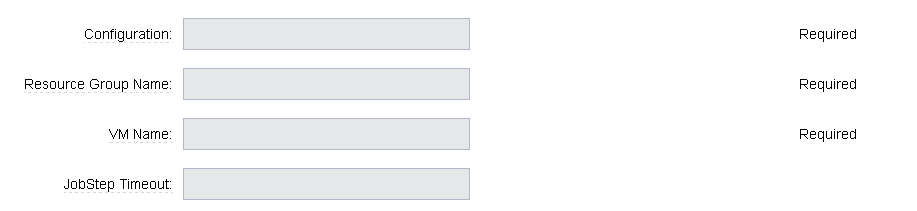

## Stop VM

This procedure allows users to stop a running VM.

<table>
<colgroup>
<col style="width: 50%" />
<col style="width: 50%" />
</colgroup>
<thead>
<tr class="header">
<th style="text-align: left;">Parameter</th>
<th style="text-align: left;">Description</th>
</tr>
</thead>
<tbody>
<tr class="odd">
<td style="text-align: left;">
Configuration
</td>
<td style="text-align: left;">
The name of the configuration which
holds all the connection information for Windows Azure.
(Required)
</td>
</tr>
<tr class="even">
<td style="text-align: left;">
Resource Group Name
</td>
<td style="text-align: left;">
The name of the resource group in which
VM is to be stopped. (Required)
</td>
</tr>
<tr class="odd">
<td style="text-align: left;">
VM Name
</td>
<td style="text-align: left;">
The Name of the Virtual Machine to be
stoppped. (Required)
</td>
</tr>
<tr class="even">
<td style="text-align: left;">
JobStep Timeout
</td>
<td style="text-align: left;">
Timeout for the step execution in
minutes. Blank means no timeout.
</td>
</tr>
</tbody>
</table>

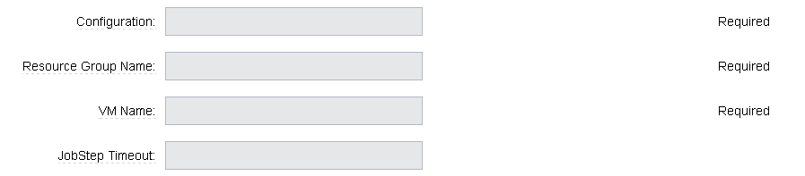

## Delete VM

This procedure allows users to delete a VM.

<table>
<colgroup>
<col style="width: 50%" />
<col style="width: 50%" />
</colgroup>
<thead>
<tr class="header">
<th style="text-align: left;">Parameter</th>
<th style="text-align: left;">Description</th>
</tr>
</thead>
<tbody>
<tr class="odd">
<td style="text-align: left;">
Configuration
</td>
<td style="text-align: left;">
The name of the configuration which
holds all the connection information for Windows Azure.
(Required)
</td>
</tr>
<tr class="even">
<td style="text-align: left;">
Resource Group Name
</td>
<td style="text-align: left;">
The name of the resource group in which
VM is present. (Required)
</td>
</tr>
<tr class="odd">
<td style="text-align: left;">
VM Name
</td>
<td style="text-align: left;">
Name of the VM which is to be deleted.
(Required)
</td>
</tr>
<tr class="even">
<td style="text-align: left;">
JobStep Timeout
</td>
<td style="text-align: left;">
Timeout for the step execution in
minutes. Blank means no timeout.
</td>
</tr>
</tbody>
</table>

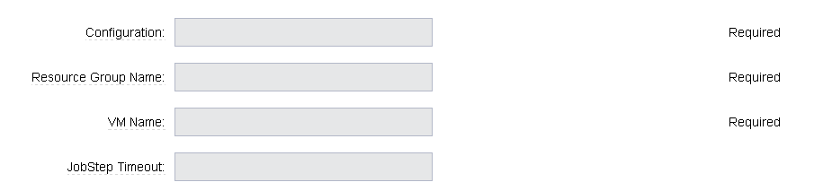

## SQL operations

This procedure allows users to carry out operations on a database on a
SQL Server.

<table>
<colgroup>
<col style="width: 50%" />
<col style="width: 50%" />
</colgroup>
<thead>
<tr class="header">
<th style="text-align: left;">Parameter</th>
<th style="text-align: left;">Description</th>
</tr>
</thead>
<tbody>
<tr class="odd">
<td style="text-align: left;">
Database Server
</td>
<td style="text-align: left;">
Name of the database server.
(Required)
</td>
</tr>
<tr class="even">
<td style="text-align: left;">
Database
</td>
<td style="text-align: left;">
Name of the database.
(Required)
</td>
</tr>
<tr class="odd">
<td style="text-align: left;">
Port
</td>
<td style="text-align: left;">
Port for connecting to database.
(Required)
</td>
</tr>
<tr class="even">
<td style="text-align: left;">
Database Credentials
</td>
<td style="text-align: left;">
Credentials for connecting to the
database. (Required)
</td>
</tr>
<tr class="odd">
<td style="text-align: left;">
SQL Query
</td>
<td style="text-align: left;">
Enter the exact SQL query to be
executed. (Required)
</td>
</tr>
<tr class="even">
<td style="text-align: left;">
JobStep Timeout
</td>
<td style="text-align: left;">
Timeout for the step execution in
minutes. Blank means no timeout.
</td>
</tr>
</tbody>
</table>

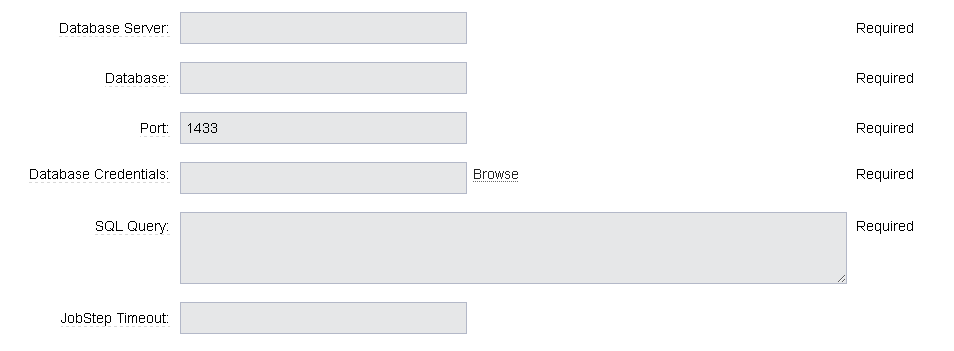

## NoSQL operations

This procedure allows users to carry out operations on NoSQL Database on
a specified NoSQL Database Server.

<table>
<colgroup>
<col style="width: 50%" />
<col style="width: 50%" />
</colgroup>
<thead>
<tr class="header">
<th style="text-align: left;">Parameter</th>
<th style="text-align: left;">Description</th>
</tr>
</thead>
<tbody>
<tr class="odd">
<td style="text-align: left;">
Storage Account
</td>
<td style="text-align: left;">
Storage account for table.
(Required)
</td>
</tr>
<tr class="even">
<td style="text-align: left;">
Account Credentials
</td>
<td style="text-align: left;">
Credentials for connecting to the
storage account. (Required)
</td>
</tr>
<tr class="odd">
<td style="text-align: left;">
Operation
</td>
<td style="text-align: left;">
Operation to be performed on the table.
(Required)
</td>
</tr>
<tr class="even">
<td style="text-align: left;">
Table Name
</td>
<td style="text-align: left;">
Name of the table. (Required)
</td>
</tr>
<tr class="odd">
<td style="text-align: left;">
ToBeInserted or ToBeUpdated
</td>
<td style="text-align: left;">
Enter the column-value in JSON format.

For Update and Single Insertion: <code>\{ "id": 4, "name": "Henry"}.</code>

For Batch Insertion: <code> [\{"id": 1, "name": "Alek"}, \{"id": 2, "name": "Bob"}]</code>.

Will be ignored for operations other than <code>INSERT</code> and <code>UPDATE</code>.
</td>
</tr>
<tr class="even">
<td style="text-align: left;">
Partition Key
</td>
<td style="text-align: left;">
Enter the partition Key. Will be used
only for INSERT operation.
</td>
</tr>
<tr class="odd">
<td style="text-align: left;">
ToBeRetrieved
</td>
<td style="text-align: left;">
Enter "," separated list of columns to
be retrieved. For example: id, name. Will be ignored for operations
other than RETRIEVE(Select)
</td>
</tr>
<tr class="even">
<td style="text-align: left;">
WhereClause
</td>
<td style="text-align: left;">
Enter the exact <code>where clause</code>.

Example:
<code>id eq 1 and name eq 'Alek\`</code>

Will be ignored for operations other than
<code>UPDATE</code>, <code>RETRIEVE</code>, and <code>DELETE.</code>
</td>
</tr>
<tr class="odd">
<td style="text-align: left;">
JobStep Timeout
</td>
<td style="text-align: left;">
Timeout for the step execution in
minutes. Blank means no timeout.
</td>
</tr>
</tbody>
</table>

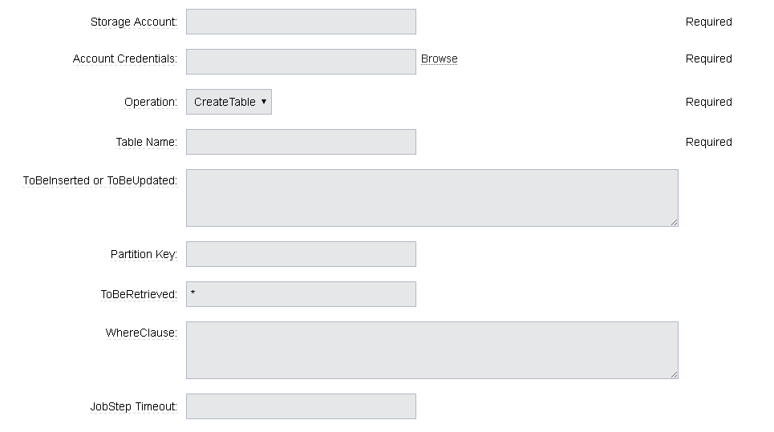

## Teardown

This procedure allows users to delete resources recursively under a
specified resource/resource pool in one attempt.

<table>
<colgroup>
<col style="width: 50%" />
<col style="width: 50%" />
</colgroup>
<thead>
<tr class="header">
<th style="text-align: left;">Parameter</th>
<th style="text-align: left;">Description</th>
</tr>
</thead>
<tbody>
<tr class="odd">
<td style="text-align: left;">
Resource/Resource Pool Name
</td>
<td style="text-align: left;">
The name of the CloudBees CD/RO resource or resource pool that need to be deleted. Precedence is given to resources to be deleted. Azure VMs attached to the resources will also be deleted. (Required)
</td>
</tr>
<tr class="even">
<td style="text-align: left;">
JobStep Timeout
</td>
<td style="text-align: left;">
Timeout for the step execution in
minutes. Blank means no timeout.
</td>
</tr>
</tbody>
</table>

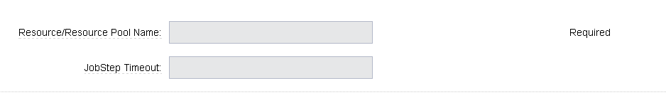

# Release notes

## EC-Azure 1.1.10

-   Documentation has been migrated to the documentation site.

## EC-Azure 1.1.9

- Renaming to *CloudBees CD/RO*.

## EC-Azure 1.1.8

- Renaming to *CloudBees*.

## EC-Azure 1.1.7

-   Configurations can be created by users with *@* sign in a name.

## EC-Azure 1.1.6

-   Logo icon has been added.

## EC-Azure 1.1.5

-   CreateVM procedure has been enhanced to support Resource Group Names
    for Storage Account and VNet that can be different from the Resource
    Group Name of the VM.

## EC-Azure 1.1.4

-   Configured the plugin to allow the ElectricFlow UI to create configs
    inline of procedure form.

-   Configured the plugin to allow the ElectricFlow UI to render the
    plugin procedure parameters entirely using the configured form XMLs.

-   Enabled the plugin for managing the plugin configurations in-line
    when defining an application process step or a pipeline stage task.

## EC-Azure 1.1.3

- New plugin version supports Azure Resource Manager Deployment Model
instead of Azure Classic. Azure Classic deployment model is no longer
supported in this version.

- Plugin is cross-platform now, that is, this plugin can work on Linux
systems along with Windows.

- Added Dynamic Environments support to EC-Azure plugin.

- EC-Azure plugin can now be found under the Resource Management category
instead of Deploy category. This is similar to EC-EC2 and EC-OpenStack
plugins.

- The following procedures have been removed while migrating the plugin to
Microsoft Azure’s Resource Manager deployment model:

   - Create Hosted Service

   - Create Storage Account

   - Get Storage Account Keys

   - Create Container

   - Put Blob

   - Create Deployment

   - Get Operation Status

   - Delete Container

   - Delete Blob

   - Delete Storage Account

   - Delete Hosted Service

## EC-Azure 1.1.0

- Updated the Create Configuration procedure.

- Added the following new procedures:

   - Create or Update Database

   - Create or Update NetworkSecurityGroup

   - Create or Update NetworkSecurityRule

   - Create or Update Subnet

   - Create VM

   - Create Vnet

   - Delete Vnet

   - Delete Database

   - Delete NetworkSecurityGroup

   - Delete NetworkSecurityRule

   - Delete Subnet

   - Delete VM

   - NoSQL Operations

   - Restart VM

   - Start VM

   - Stop VM

   - SQL Operations

   - TearDown

## EC-Azure 1.0.2

-   Fixed the issue with configurations being cached for IE.

## EC-Azure 1.0.0

- Configuration Management

* Procedures added: 
   - Create Hosted Service
   - Create Storage Account
   - Get Storage Account Keys
   - Create Container
   - Put Blob
   - Create Deployment
   - Get Operation Status
   - Delete Container
   - Delete Blob
   - Delete Storage Account
   - Delete Hosted Service

-   Implemented Console Application AzureRequest.exe.

-   Implemented GWT parameter panels.

-   Implemented XML parameter panels.

-   Implemented postp matchers.

-   Added Help link to each procedure.

-   Added a detailed Use Case.
